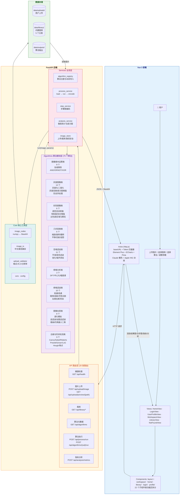

# 基于动漫图像识别的交互式数字图像处理系统

## 1. 项目定位

本项目是一个面向数字图像处理课程设计的 Web 交互式系统，主题确定为：

> **基于动漫图像识别的交互式数字图像处理系统**

项目围绕"动漫相关图像"展开，用户可以上传动漫人物、动漫场景、二次元插画、头像、截图等图片，也可以从项目内置图片库中选择示例图片。系统通过后端图像处理算法对图片进行实时处理，并在前端页面即时展示处理后的结果、算法参数、分步过程和结果分析。

本项目需要同时满足两类目标：

1. **课程设计目标**：覆盖数字图像处理中的基础运算、灰度变换、几何变换、空域滤波、频域滤波、彩色图像处理、图像复原、形态学处理、边缘检测等内容。
2. **项目开发目标**：采用 Vue + FastAPI 前后端分离架构，后端算法高度模块化，便于多人协作开发和前端自由组合调用。

---

## 2. 已确定技术路线

| 类型 | 技术选型 | 说明 |
|---|---|---|
| 项目主题 | 动漫相关图像识别 | 以动漫人物、头像、插画、场景截图为主要处理对象 |
| 前端框架 | Vue 3 + Vite | 用于实现交互式 Web 页面 |
| 前端请求 | Axios | 封装 baseURL、Token 拦截器、响应拦截 |
| 前端 UI | Element Plus | 组件成熟，适合课程展示，已全局注册 |
| 前端状态管理 | Pinia + pinia-plugin-persistedstate | 用户认证状态持久化 |
| 前端图表 | ECharts + vue-echarts | 用于展示直方图、指标曲线、对比图 |
| 前端样式 | SCSS + Element Plus 主题 | 全局样式 + 组件级 scoped 样式 |
| 包管理器 | pnpm | 前端依赖安装与项目管理 |
| 后端框架 | FastAPI | 提供图片上传、图库读取、算法处理、结果返回接口 |
| 后端语言 | Python | 所有图像处理与识别功能均使用 Python 实现 |
| 图像处理库 | OpenCV、Pillow、scikit-image、SciPy | 覆盖主要数字图像处理算法 |
| 图像识别方式 | OpenCV 特征 + scikit-learn 轻量分类/匹配 | 先不强制使用深度学习，降低部署难度 |
| 开发系统 | Windows 11 | 全体成员统一 Windows 11 环境 |
| Python 环境 | venv 虚拟环境 | 保证每名成员环境一致，避免依赖冲突 |
| 部署方式 | 本地运行 | 不使用 Docker |
| 协作重点 | 后端算法模块 | 每个具体功能独立文件，按分类划归到小模块 |

---

## 3. 总体系统架构



---

## 4. 项目目录结构

```text
Digital-image-processing-Design/
├─ README.md
├─ requirements.txt
├─ LICENSE
├─ .gitignore
│
├─ docs/
│  ├─ CHANGELOG01.md
│  ├─ CHANGELOG02.md
│  ├─ CHANGELOG03.md
│  ├─ CHANGELOG04.md
│  ├─ CHANGELOG06.md
│  ├─ CHANGELOG07.md
│  ├─ CHANGELOG08.md
│  ├─ prompts/
│  │  └─ algorithm_improvement_prompts_7_models/
│  │     ├─ chatgpt_algorithm_improvement_slider_prompt.md
│  │     ├─ claude_algorithm_improvement_slider_prompt.md
│  │     ├─ deepseek_algorithm_improvement_slider_prompt.md
│  │     ├─ doubao_algorithm_improvement_slider_prompt.md
│  │     ├─ gemini_algorithm_improvement_slider_prompt.md
│  │     ├─ glm_algorithm_improvement_slider_prompt.md
│  │     └─ kimi_algorithm_improvement_slider_prompt.md
│  └─ 算法书写规范说明文档.docx
│
├─ backend/
│  ├─ main.py                                # FastAPI 应用入口
│  ├─ README.md                              # 后端文件说明、前端联调和环境配置
│  │
│  ├─ app/
│  │  ├─ __init__.py
│  │  │
│  │  ├─ core/                               # 核心配置与工具模块
│  │  │  ├─ __init__.py
│  │  │  ├─ config.py                        # 应用全局配置
│  │  │  ├─ cors.py                          # CORS 跨域配置
│  │  │  ├─ image_codec.py                   # 图像编解码工具
│  │  │  ├─ image_io.py                      # 图像文件读写（含中文路径支持）
│  │  │  ├─ upload_config.py                 # 上传配置
│  │  │  └─ upload_validator.py              # 上传文件校验
│  │  │
│  │  ├─ api/                                # API 路由层（均委托 services 层处理业务逻辑）
│  │  │  ├─ __init__.py
│  │  │  ├─ algorithms.py                    # GET /api/algorithms 算法元数据查询
│  │  │  ├─ analysis.py                      # POST /api/analysis/metrics 图片指标计算
│  │  │  ├─ health.py                        # GET /api/health 健康检查
│  │  │  ├─ library.py                       # 内置图片库分类/列表/文件接口
│  │  │  ├─ process.py                       # POST /api/process/run 算法处理主入口
│  │  │  ├─ upload.py                        # 图片上传与预览接口
│  │  │  └─ algorithm_modules/               # 九大分类独立子路由（GET 列表 + POST 执行）
│  │  │     ├─ __init__.py
│  │  │     ├─ basic_operation.py
│  │  │     ├─ color_image.py
│  │  │     ├─ common.py                     # 共享常量和通用处理逻辑
│  │  │     ├─ edge_shape_detection.py
│  │  │     ├─ frequency_analysis.py
│  │  │     ├─ frequency_filter.py
│  │  │     ├─ geometric_transform.py
│  │  │     ├─ grayscale_image.py
│  │  │     ├─ image_restoration.py
│  │  │     └─ spatial_filter.py
│  │  │
│  │  ├─ schemas/                            # Pydantic 数据校验模型
│  │  │  ├─ __init__.py
│  │  │  ├─ algorithm_schema.py
│  │  │  ├─ image_schema.py
│  │  │  ├─ process_schema.py
│  │  │  └─ response_schema.py
│  │  │
│  │  ├─ services/                           # 业务逻辑服务层
│  │  │  ├─ __init__.py
│  │  │  ├─ algorithm_registry.py            # 算法注册与发现
│  │  │  ├─ analysis_service.py              # 图像分析服务
│  │  │  ├─ image_store.py                   # 图像存储管理
│  │  │  ├─ process_service.py               # 算法处理调度
│  │  │  └─ step_service.py                  # 分步执行服务
│  │  │
│  │  └─ algorithms/                         # 图像处理算法模块
│  │     ├─ __init__.py
│  │     ├─ common.py                         # 算法共享工具函数
│  │     ├─ 算法框架填写说明.md
│  │     ├─ 分工文档.md
│  │     │
│  │     ├─ basic_operation/                  # 8.0 图像基本运算类
│  │     │  ├─ __init__.py
│  │     │  ├─ add_operation.py               # 图像加法
│  │     │  ├─ subtract_operation.py          # 图像减法
│  │     │  ├─ multiply_operation.py          # 图像乘法
│  │     │  ├─ divide_operation.py            # 图像除法
│  │     │  ├─ and_operation.py               # 图像与运算
│  │     │  ├─ or_operation.py                # 图像或运算
│  │     │  ├─ not_operation.py               # 图像非运算
│  │     │  └─ xor_operation.py               # 图像异或运算
│  │     │
│  │     ├─ grayscale_image/                 # 8.1 灰度图像类
│  │     │  ├─ __init__.py
│  │     │  ├─ linear_gray_transform.py      # 线性灰度变换
│  │     │  ├─ gamma_correction.py           # 伽马校正
│  │     │  ├─ log_transform.py              # 对数变换
│  │     │  ├─ exponential_transform.py      # 指数变换
│  │     │  ├─ negative_transform.py         # 负片变换
│  │     │  ├─ grayscale.py                  # 灰度化
│  │     │  ├─ binary_threshold.py           # 二值化
│  │     │  ├─ histogram_equalization.py     # 直方图均衡化
│  │     │  ├─ clahe_equalization.py         # CLAHE
│  │     │  ├─ histogram_matching.py         # 直方图匹配
│  │     │  ├─ erode.py                      # 腐蚀
│  │     │  ├─ dilate.py                     # 膨胀
│  │     │  ├─ open_operation.py             # 开运算
│  │     │  └─ close_operation.py            # 闭运算
│  │     │
│  │     ├─ color_image/                     # 8.2 彩色图像类
│  │     │  ├─ __init__.py
│  │     │  ├─ color_space_convert.py        # 颜色空间转换
│  │     │  ├─ saturation_adjust.py          # 饱和度调整
│  │     │  ├─ anime_color_enhance.py        # 动漫色彩增强
│  │     │  ├─ dominant_color_extract.py     # 主色调提取
│  │     │  ├─ region_mosaic.py              # 指定区域马赛克
│  │     │  └─ color_comprehensive_processing.py  # 彩色图像综合处理
│  │     │
│  │     ├─ geometric_transform/             # 8.3 几何变换类
│  │     │  ├─ __init__.py
│  │     │  ├─ resize.py                     # 图像缩放
│  │     │  ├─ rotate.py                     # 图像旋转
│  │     │  ├─ flip.py                       # 图像翻转
│  │     │  ├─ translate.py                  # 图像平移
│  │     │  ├─ affine_transform.py           # 仿射变换
│  │     │  └─ perspective_transform.py      # 投影变换
│  │     │
│  │     ├─ spatial_filter/                  # 8.4 空域滤波类
│  │     │  ├─ __init__.py
│  │     │  ├─ mean_filter.py                # 均值滤波
│  │     │  ├─ gaussian_filter.py            # 高斯滤波
│  │     │  ├─ median_filter.py              # 中值滤波
│  │     │  ├─ bilateral_filter.py           # 双边滤波
│  │     │  ├─ laplacian_sharpen.py          # 拉普拉斯锐化
│  │     │  ├─ statistical_order_filter.py   # 统计排序滤波
│  │     │  ├─ max_filter.py                 # 最大值滤波
│  │     │  ├─ min_filter.py                 # 最小值滤波
│  │     │  ├─ adaptive_median_filter.py     # 自适应中值滤波
│  │     │  ├─ unsharp_masking.py            # USM 锐化
│  │     │  └─ add_noise.py                  # 噪声添加
│  │     │
│  │     ├─ frequency_analysis/              # 8.5 频域分析类
│  │     │  ├─ __init__.py
│  │     │  ├─ dft_spectrum.py               # 傅里叶频谱显示
│  │     │  ├─ spectrum_shift.py             # 频谱中心化
│  │     │  └─ magnitude_spectrum.py         # 幅度谱显示
│  │     │
│  │     ├─ frequency_filter/                # 8.6 频域滤波类
│  │     │  ├─ __init__.py
│  │     │  ├─ low_pass_filter.py            # 低通滤波
│  │     │  ├─ high_pass_filter.py           # 高通滤波
│  │     │  ├─ ideal_low_pass.py             # 理想低通滤波
│  │     │  ├─ ideal_high_pass.py            # 理想高通滤波
│  │     │  ├─ gaussian_low_pass.py          # 高斯低通滤波
│  │     │  ├─ gaussian_high_pass.py         # 高斯高通滤波
│  │     │  ├─ butterworth_low_pass.py       # 巴特沃斯低通滤波
│  │     │  ├─ butterworth_high_pass.py      # 巴特沃斯高通滤波
│  │     │  ├─ frequency_laplacian_sharpen.py  # 频域拉普拉斯锐化
│  │     │  └─ homomorphic_filter.py         # 同态滤波
│  │     │
│  │     ├─ image_restoration/               # 8.7 图像复原与图像修复类
│  │        ├─ __init__.py
│  │        ├─ defocus_blur_simulation.py          # 散焦模糊模拟
│  │        ├─ lens_distortion_blur_simulation.py  # 镜头畸变模糊模拟
│  │        ├─ motion_blur_simulation.py           # 运动模糊模拟
│  │        ├─ atmospheric_turbulence_blur_simulation.py  # 大气湍流模糊模拟
│  │        ├─ inverse_filter_restoration.py       # 逆滤波复原
│  │        ├─ windowed_inverse_filter_restoration.py  # 加窗逆滤波复原
│  │        ├─ wiener_filter_restoration.py        # 维纳滤波复原
│  │        └─ constrained_least_squares_restoration.py  # 约束最小二乘复原
│  │     │
│  │     └─ edge_shape_detection/             # 8.8 边缘与形状检测类
│  │        ├─ __init__.py
│  │        ├─ basic_edge_detection.py        # 基础边缘检测入口
│  │        ├─ canny_edge_detection.py        # Canny 边缘检测
│  │        ├─ sobel_edge_detection.py        # Sobel 边缘检测
│  │        ├─ roberts_cross.py               # Roberts 交叉算子
│  │        ├─ prewitt_edge_detection.py      # Prewitt 边缘检测
│  │        ├─ scharr_edge_detection.py       # Scharr 边缘检测
│  │        ├─ log_edge_detection.py          # LoG 边缘检测
│  │        ├─ hough_shape_detection.py       # Hough 形状检测
│  │        └─ corner_detection.py            # 角点检测
│  │
│  ├─ data/
│  │  ├─ image_limit.md                      # 图片限制说明文档
│  │  ├─ uploads/                            # 用户上传图片运行目录，仅提交 .gitkeep
│  │  ├─ library/                            # 内置图片库
│  │  │  ├─ anime_character/                 #   动漫人物图像
│  │  │  ├─ anime_scene/                     #   动漫场景图像
│  │  │  ├─ anime_avatar/                    #   动漫头像图像
│  │  │  ├─ course_samples/                  #   课程实验素材
│  │  │  └─ other/                           #   其他测试图像
│  │  ├─ test_images/                        # 测试输入图片
│  │  ├─ test_outputs/                       # 测试输出图片运行目录，仅提交 .gitkeep
│  │  └─ outputs/                            # 算法处理输出运行目录，仅提交 .gitkeep
│  │
│  └─ tests/
│     ├─ README.md
│     ├─ manual_test_algorithm.py             # 初学者三路径手动测试脚本
│     ├─ test_algorithm_completeness.py       # 算法完整性测试
│     ├─ test_backend_framework.py            # 后端框架自动化测试
│     ├─ 算法测试脚本使用说明文档.md
│     └─ sample_test_configs/
│        ├─ add_operation_example.json
│        ├─ saturation_adjust_example.json
│        ├─ grayscale_example.json
│        ├─ binary_threshold_example.json
│        ├─ canny_example.json
│        ├─ sobel_edge_detection_example.json
│        ├─ gamma_correction_example.json
│        ├─ gaussian_filter_example.json
│        ├─ dft_spectrum_example.json
│        ├─ ideal_low_pass_example.json
│        ├─ ideal_high_pass_example.json
│        ├─ motion_blur_simulation_example.json
│        └─ wiener_filter_restoration_example.json
│
└─ frontend/
   ├─ .env.development                     # 开发环境变量（VITE_API_BASE_URL）
   ├─ .gitignore
   ├─ .vscode/
   │  └─ extensions.json
   ├─ README.md                            # 前端环境搭建与运行说明
   ├─ package.json
   ├─ pnpm-lock.yaml
   ├─ pnpm-workspace.yaml
   ├─ jsconfig.json
   ├─ vite.config.js                       # Vite + Element Plus 自动导入 + @ 别名
   ├─ index.html
   ├─ public/
   │  └─ favicon.ico
   └─ src/
      ├─ main.js                           # 入口：Pinia + Router + Element Plus + 图标全局注册
      ├─ App.vue
      ├─ api/                               # 后端 API 请求模块
      │  ├─ .gitkeep
      │  ├─ http.js                        # Axios 实例（baseURL / Token 拦截器 / 错误提示）
      │  ├─ health.js                      # GET /api/health 健康检查
      │  ├─ upload.js                      # POST /api/upload/image 图片上传
      │  ├─ algorithms.js                  # GET /api/algorithms 算法列表
      │  ├─ library.js                     # GET /api/library/* 图像库接口
      │  └─ run.js                         # POST /api/algorithms/{slug}/run 算法执行（动态端点，支持全部 9 模块）
      ├─ assets/
      │  ├─ .gitkeep
      │  ├─ background/                    # 登录页轮播背景图片（4 张）
      │  │  ├─ bg1.jpg
      │  │  ├─ bg2.jpg
      │  │  ├─ bg3.jpg
      │  │  └─ bg4.jpg
      │  └─ home_bg.jpg                    # 首页背景
      ├─ components/                        # 公共布局组件（3 个）
      │  ├─ HeaderNav.vue                  # 顶部导航栏
      │  ├─ MainLayout.vue                 # 主布局
      │  ├─ AppFooter.vue                  # 页脚组件
      ├─ router/
      │  └─ index.js                       # 路由：/home /workspace /library /profile /login（懒加载）
      ├─ stores/
      │  └─ authStore.js                   # 用户认证状态（Pinia + 持久化插件）
      ├─ styles/
      │  └─ index.scss                     # Claude 暖色 Token + Apple HIG 动效 + WarmDust 动画
      ├─ utils/
      │  ├─ .gitkeep
      │  ├─ check_health.js                # 后端健康检查（页面加载时调用）
      │  └─ token.js                       # JWT Token 生成工具（本地测试用）
      └─ views/                             # 页面视图（装配层）
         ├─ HomeView.vue                   # 首页（4 子组件装配 + TOC 侧栏 + scrollSpy）
         ├─ LoginView.vue                  # 登录/注册页（hero + card 装配 + tab 切）
         ├─ UserProfileView.vue             # 个人中心（sidebar + 3 form 装配）
         ├─ WorkspaceView.vue              # 工作区（三栏装配：算法树 / 工作区 / 参数）
         ├─ LibraryView.vue                # 图像库（侧栏 + hero + 网格 + 底部抽屉装配）
         └─ NotFoundView.vue               # 404 页面（Apple HIG stagger 入场动画）
```

---

## 5. 后端模块化开发要求

### 5.1 一个具体功能一个文件

后端所有具体算法必须拆成单独文件，不允许把多个算法全部堆在一个大文件中。

正确示例：

```text
algorithms/edge_shape_detection/canny_edge_detection.py
algorithms/grayscale_image/binary_threshold.py
algorithms/spatial_filter/median_filter.py
algorithms/frequency_analysis/dft_spectrum.py
algorithms/frequency_filter/low_pass_filter.py
```

错误示例：

```text
algorithms/all_filters.py
algorithms/all_algorithms.py
```

### 5.2 每个文件第一行必须是中文功能说明

所有 `.py`、`.js`、`.vue`、`.md`、`.txt` 文件第一行都必须写中文功能说明。

Python 文件示例：

```python
# 本文件用于实现动漫图像的通用边缘检测功能
```

Vue 文件示例：

```vue
<!-- 本文件用于实现图像处理页面的算法选择与结果展示功能 -->
```

JavaScript 文件示例：

```javascript
// 本文件用于封装图像处理相关的后端接口请求
```

Markdown 文件示例：

```markdown
# 本文件用于说明项目整体架构与协作开发规范
```

### 5.3 每个算法文件的统一接口规范

每个算法文件建议统一提供 `run` 函数，方便前端动态选择算法后，后端可以通过注册表统一调用。

```python
# 本文件用于实现动漫图像的 Canny 边缘检测功能

import cv2
import numpy as np


ALGORITHM_META = {
    "module": "edge_shape_detection",
    "name": "canny_edge_detection",
    "display_name": "Canny边缘检测",
    "description": "用于提取动漫人物轮廓、发丝边缘、场景建筑线条等边缘信息。",
    "params": {
        "threshold1": {
            "type": "int",
            "default": 80,
            "min": 0,
            "max": 255,
            "step": 1,
            "label": "阈值1",
            "component": "slider"
        },
        "threshold2": {
            "type": "int",
            "default": 160,
            "min": 0,
            "max": 255,
            "step": 1,
            "label": "阈值2",
            "component": "slider"
        },
        "blur_size": {
            "type": "int",
            "default": 3,
            "min": 1,
            "max": 15,
            "step": 2,
            "label": "模糊核大小",
            "component": "slider"
        }
    }
}


def run(image: np.ndarray, params: dict) -> dict:
    threshold1 = int(params.get("threshold1", 80))
    threshold2 = int(params.get("threshold2", 160))
    blur_size = int(params.get("blur_size", 3))

    if blur_size % 2 == 0:
        blur_size += 1

    gray = cv2.cvtColor(image, cv2.COLOR_BGR2GRAY)
    blurred = cv2.GaussianBlur(gray, (blur_size, blur_size), 0)
    edge = cv2.Canny(blurred, threshold1, threshold2)

    return {
        "result": edge,
        "steps": [
            {"name": "灰度化", "image": gray},
            {"name": "高斯平滑", "image": blurred},
            {"name": "边缘检测", "image": edge}
        ],
        "metrics": {
            "threshold1": threshold1,
            "threshold2": threshold2,
            "blur_size": blur_size
        },
        "analysis": "Canny 算法可以突出动漫图像中的人物轮廓、头发边缘和服装线条。阈值越低，边缘越丰富，但噪声也越明显。"
    }
```

---

## 6. 前端即时选择算法的实现逻辑

前端页面不应该写死算法按钮，而应该从后端读取算法清单。

### 6.1 前端启动后读取算法列表

```text
GET /api/algorithms
```

返回示例：

```json
{
  "modules": [
    {
      "module": "edge_shape_detection",
      "display_name": "边缘与形状检测类",
      "algorithms": [
        {
          "name": "canny_edge_detection",
          "display_name": "Canny边缘检测",
          "params": {
            "threshold1": {
              "type": "int", "default": 80, "min": 0, "max": 255,
              "step": 1, "label": "阈值1", "component": "slider"
            },
            "threshold2": {
              "type": "int", "default": 160, "min": 0, "max": 255,
              "step": 1, "label": "阈值2", "component": "slider"
            }
          }
        }
      ]
    }
  ]
}
```

### 6.2 用户选择算法后立即请求处理

```text
POST /api/process/run
```

请求示例：

```json
{
  "source_type": "upload",
  "image_path": "upload_20260525_001.png",
  "module": "edge_shape_detection",
  "algorithm": "canny_edge_detection",
  "params": {
    "threshold1": 80,
    "threshold2": 160,
    "blur_size": 3
  },
  "return_steps": true
}
```

返回示例：

```json
{
  "success": true,
  "module": "edge_shape_detection",
  "module_display_name": "边缘与形状检测类",
  "algorithm": "canny_edge_detection",
  "algorithm_display_name": "Canny边缘检测",
  "result_image": "data:image/png;base64,...",
  "steps": [
    {
      "name": "灰度化",
      "image": "data:image/png;base64,..."
    },
    {
      "name": "Canny 边缘检测",
      "image": "data:image/png;base64,..."
    }
  ],
  "metrics": {
    "mean": 126.5,
    "std": 42.1,
    "edge_density": 0.18
  },
  "analysis": "处理后图像中的人物轮廓更加清晰，适合用于动漫角色线稿提取。"
}
```

---

## 7. 图片来源设计

系统必须为用户提供两种图片来源。

### 7.1 用户实时上传图片

用户上传本地图片，后端保存到：

```text
backend/data/uploads/
```

该目录是运行时目录，仓库中只保留 `.gitkeep`。实际上传图片、算法输出图、测试输出图均由 `.gitignore` 忽略，不作为源码提交内容。

推荐接口：

```text
POST /api/upload/image
```

支持格式：

```text
jpg、jpeg、png、bmp、tif、tiff、webp
```

上传后返回：

```json
{
  "success": true,
  "image_path": "upload_xxx.png",
  "filename": "upload_xxx.png",
  "width": 800,
  "height": 600,
  "preview_url": "/api/upload/preview/upload_xxx.png",
  "message": "图片上传成功"
}
```

前后端传递图片时统一使用 `image_path` 作为图片定位字段。上传接口返回的 `image_path` 可继续用于 `/api/upload/preview/{image_path}`、`/api/process/run` 和 `/api/analysis/metrics`，不再保留重复图片编号字段。

### 7.2 项目内置图片库

项目内置图片库保存到：

```text
backend/data/library/
```

推荐分类：

```text
anime_character/     动漫人物图像
anime_scene/         动漫场景图像
anime_avatar/        动漫头像图像
course_samples/      课程实验素材图像
other/               其他测试图像
```

推荐接口：

```text
GET /api/library/categories
GET /api/library/images?category=anime_character
GET /api/library/image/{image_path}
```

图片库的作用：

1. 防止用户没有合适测试图片时无法演示。
2. 便于课程答辩时快速展示固定案例。
3. 便于小组成员调试同一张图片，保证结果一致。
4. 可将之前上传课程资料中的实验图像整理到 `course_samples` 中作为通用测试样例。

---

## 8. 功能模块清单

当前后端算法主目录按 9 类组织，75 个算法已全部实现。

### 8.0 `basic_operation/` 图像基本运算类

| 功能名称 | 文件名                  | 功能说明                                           | 状态   |
| -------- | ----------------------- | -------------------------------------------------- | ------ |
| 图像加法 | `add_operation.py`      | 两张图像加权相加，可调节权重和亮度增益             | 已实现 |
| 图像减法 | `subtract_operation.py` | 两张图像逐像素相减，可用于变化检测和差异比较       | 已实现 |
| 图像乘法 | `multiply_operation.py` | 两张图像归一化相乘，可用于掩膜和增强               | 已实现 |
| 图像除法 | `divide_operation.py`   | 第一张图像除以第二张，可用于去光照和归一化         | 已实现 |
| 图像与   | `and_operation.py`      | 两张图像按位与，可用于掩膜提取                     | 已实现 |
| 图像或   | `or_operation.py`       | 两张图像按位或，可用于区域合并                     | 已实现 |
| 图像非   | `not_operation.py`      | 单张图像按位取反，产生负片/反色效果                | 已实现 |
| 图像异或 | `xor_operation.py`      | 两张图像按位异或，可用于加密和差异高亮             | 已实现 |

---

### 8.1 `grayscale_image/` 灰度图像类

| 功能名称     | 文件名                      | 功能说明                                                     | 状态     |
| ------------ | --------------------------- | ------------------------------------------------------------ | -------- |
| 线性灰度变换 | `linear_gray_transform.py`  | 线性变换 g = alpha*f + beta，调整图像对比度与亮度            | 已实现 |
| 伽马校正     | `gamma_correction.py`       | 幂律变换，校正显示设备的非线性响应，增强暗部或亮部细节       | 已实现 |
| 对数变换     | `log_transform.py`          | 对数动态范围压缩，增强低灰度区域细节                         | 已实现 |
| 指数变换     | `exponential_transform.py`  | 指数动态范围扩展，增强高灰度区域对比度                       | 已实现 |
| 负片变换     | `negative_transform.py`     | 灰度反转 255 - pixel，可保持彩色通道仅反转亮度               | 已实现 |
| 灰度化       | `grayscale.py`              | 将彩色图像转换为灰度图像，作为二值化、边缘检测、频域分析等算法的基础输入 | 已实现 |
| 二值化       | `binary_threshold.py`       | 将灰度图转换为黑白二值图，支持固定阈值                       | 已实现 |
| 直方图均衡化 | `histogram_equalization.py` | 增强灰度图像整体对比度，使灰度分布更加均衡                   | 已实现 |
| CLAHE | `clahe_equalization.py` | 对比度受限自适应直方图均衡化，增强局部细节并限制噪声放大 | 已实现 |
| 直方图匹配 | `histogram_matching.py` | 根据第二张图像进行灰度分布规定化，使用 `second_image_path` 输入参考图 | 已实现 |
| 腐蚀         | `erode.py`                  | 缩小前景区域，去除小白点或细小噪声                           | 已实现 |
| 膨胀         | `dilate.py`                 | 扩大前景区域，连接断裂区域或增强目标区域                     | 已实现 |
| 开运算       | `open_operation.py`         | 先腐蚀后膨胀，适合去除小噪声                                 | 已实现 |
| 闭运算       | `close_operation.py`        | 先膨胀后腐蚀，适合填补小孔洞、连接断裂区域                   | 已实现 |

---

### 8.2 `color_image/` 彩色图像类

| 功能名称     | 文件名                      | 功能说明                                                     | 状态   |
| ------------ | --------------------------- | ------------------------------------------------------------ | ------ |
| 颜色空间转换 | `color_space_convert.py`    | 将 BGR 图像转换为灰度、HSV 或 Lab 表示，并生成便于展示的可视化结果 | 已实现 |
| 饱和度调整   | `saturation_adjust.py`      | 基于 HSV 色彩空间调整动漫图像的色相、饱和度和明度，使人物和场景颜色更突出 | 已实现 |
| 动漫色彩增强 | `anime_color_enhance.py`    | 综合调整饱和度、对比度、亮度和轻微锐化，突出动漫图像的明快色彩与线条层次 | 已实现 |
| 主色调提取   | `dominant_color_extract.py` | 使用 K-Means 聚类提取动漫图像中的主要颜色，并生成主色调量化可视化结果 | 已实现 |
| 指定区域马赛克 | `region_mosaic.py` | 对指定比例区域进行块状像素化，适合局部隐私遮挡或风格化处理 | 已实现 |
| 彩色图像综合处理 | `color_comprehensive_processing.py` | 组合亮度、对比度、饱和度、色相和锐化参数完成彩色增强 | 已实现 |

---

### 8.3 `geometric_transform/` 几何变换类

| 功能名称 | 文件名      | 功能说明                                   | 状态     |
| -------- | ----------- | ------------------------------------------ | -------- |
| 缩放     | `resize.py` | 改变图像尺寸，支持按比例缩放和指定宽高缩放 | 已实现 |
| 旋转     | `rotate.py` | 按指定角度旋转图像，支持边界填充和中心旋转 | 已实现 |
| 翻转     | `flip.py`   | 实现水平翻转、垂直翻转和中心翻转           | 已实现 |
| 平移     | `translate.py` | 按 X/Y 像素偏移移动图像并支持边界填充 | 已实现 |
| 仿射变换 | `affine_transform.py` | 通过三点映射完成缩放、错切、旋转等仿射变换 | 已实现 |
| 投影变换 | `perspective_transform.py` | 通过四点映射完成透视校正和投影变换 | 已实现 |

---

### 8.4 `spatial_filter/` 空域滤波类

| 功能名称     | 文件名                 | 功能说明                                                     | 状态     |
| ------------ | ---------------------- | ------------------------------------------------------------ | -------- |
| 均值滤波     | `mean_filter.py`       | 使用邻域平均值进行平滑处理，可降低随机噪声，但会造成一定模糊 | 已实现 |
| 高斯滤波     | `gaussian_filter.py`   | 使用高斯核进行平滑处理，适合去除一般噪声并保留较自然的过渡   | 已实现 |
| 中值滤波     | `median_filter.py`     | 使用邻域中值替代中心像素，对椒盐噪声有较好去除效果           | 已实现 |
| 双边滤波     | `bilateral_filter.py`  | 在平滑图像的同时尽量保留边缘，适合动漫线条图像降噪           | 已实现 |
| 拉普拉斯锐化 | `laplacian_sharpen.py` | 增强图像边缘和细节，使轮廓更清晰                             | 已实现 |
| 统计排序滤波 | `statistical_order_filter.py` | 按邻域排序统计值进行滤波，支持中值、最大值、最小值和中点模式 | 已实现 |
| 最大值滤波 | `max_filter.py` | 使用邻域最大值扩展亮区域并抑制暗孤立点 | 已实现 |
| 最小值滤波 | `min_filter.py` | 使用邻域最小值扩展暗区域并抑制亮孤立点 | 已实现 |
| 自适应中值滤波 | `adaptive_median_filter.py` | 根据局部噪声情况扩大窗口，增强椒盐噪声去除能力 | 已实现 |
| USM锐化 | `unsharp_masking.py` | 通过模糊差分增强高频细节和轮廓 | 已实现 |
| 噪声添加 | `add_noise.py` | 添加高斯、椒盐或泊松噪声，用于退化模拟和滤波测试 | 已实现 |

---

### 8.5 `frequency_analysis/` 频域分析类

| 功能名称           | 文件名                  | 功能说明                                                     | 状态     |
| ------------------ | ----------------------- | ------------------------------------------------------------ | -------- |
| 傅里叶变换显示频谱 | `dft_spectrum.py`       | 将图像转换到频域并显示频谱图，用于观察图像低频和高频信息分布 | 已实现 |
| 频谱中心化         | `spectrum_shift.py`     | 对傅里叶频谱进行中心化，将低频成分移动到频谱中心             | 已实现 |
| 幅度谱显示         | `magnitude_spectrum.py` | 计算并显示图像傅里叶变换后的幅度谱                           | 已实现 |

---

### 8.6 `frequency_filter/` 频域滤波类

| 功能名称     | 文件名                  | 功能说明                                             | 状态     |
| ------------ | ----------------------- | ---------------------------------------------------- | -------- |
| 低通滤波     | `low_pass_filter.py`    | 保留低频信息，抑制高频信息，实现图像平滑和降噪       | 已实现 |
| 高通滤波     | `high_pass_filter.py`   | 保留高频信息，抑制低频信息，用于增强边缘和细节       | 已实现 |
| 理想低通滤波 | `ideal_low_pass.py`     | 使用理想圆形掩膜进行低通滤波，效果直观但可能产生振铃 | 已实现 |
| 理想高通滤波 | `ideal_high_pass.py`    | 使用理想圆形掩膜进行高通滤波，用于突出边缘变化       | 已实现 |
| 高斯低通滤波 | `gaussian_low_pass.py`  | 使用高斯频域掩膜进行平滑，过渡更自然                 | 已实现 |
| 高斯高通滤波 | `gaussian_high_pass.py` | 使用高斯频域掩膜增强边缘，减少理想滤波带来的振铃问题 | 已实现 |
| 巴特沃斯低通滤波 | `butterworth_low_pass.py` | 使用可调阶数的巴特沃斯传递函数平滑图像 | 已实现 |
| 巴特沃斯高通滤波 | `butterworth_high_pass.py` | 使用巴特沃斯高通传递函数增强边缘和细节 | 已实现 |
| 频域拉普拉斯锐化 | `frequency_laplacian_sharpen.py` | 在频域构造拉普拉斯增强项进行锐化 | 已实现 |
| 同态滤波 | `homomorphic_filter.py` | 对数域分离照度和反射分量，压低低频光照并增强细节 | 已实现 |

---

### 8.7 `image_restoration/` 图像复原类

| 功能名称             | 文件名                                      | 功能说明                                       | 状态   |
| -------------------- | ------------------------------------------- | ---------------------------------------------- | ------ |
| 散焦模糊模拟         | `defocus_blur_simulation.py`                | 使用圆盘 PSF 模拟散焦模糊退化                  | 已实现 |
| 镜头畸变模糊模拟     | `lens_distortion_blur_simulation.py`         | 模拟径向畸变与模糊叠加的复合退化               | 已实现 |
| 运动模糊模拟         | `motion_blur_simulation.py`                 | 使用线性 PSF 模拟匀速直线运动模糊              | 已实现 |
| 大气湍流模糊模拟     | `atmospheric_turbulence_blur_simulation.py`  | 使用频域湍流传递函数模拟大气扰动退化           | 已实现 |
| 逆滤波复原           | `inverse_filter_restoration.py`             | 频域逆滤波直接复原，对无噪声退化图效果较好     | 已实现 |
| 加窗逆滤波复原       | `windowed_inverse_filter_restoration.py`    | 使用低通窗限制逆滤波高频放大，改善噪声敏感性   | 已实现 |
| 维纳滤波复原         | `wiener_filter_restoration.py`              | 带噪声抑制的反卷积复原，信噪比自适应的最优滤波 | 已实现 |
| 约束最小二乘复原     | `constrained_least_squares_restoration.py`   | 拉普拉斯约束的正则化复原，抑制噪声放大         | 已实现 |

---

### 8.8 `edge_shape_detection/` 边缘与形状检测类

| 功能名称 | 文件名 | 功能说明 | 状态 |
| -------- | ------ | -------- | ---- |
| 基础边缘检测 | `basic_edge_detection.py` | 统一边缘检测入口，可选择 Canny、Sobel、Prewitt、Roberts、Scharr 或 LoG | 已实现 |
| Canny边缘检测 | `canny_edge_detection.py` | 使用 Canny 算子提取图像中的主要轮廓和边界 | 已实现 |
| Sobel边缘检测 | `sobel_edge_detection.py` | 使用 Sobel 一阶梯度算子提取 X/Y/综合方向的边缘强度 | 已实现 |
| Roberts交叉算子 | `roberts_cross.py` | 用 2x2 交叉梯度核检测细小边缘 | 已实现 |
| Prewitt边缘检测 | `prewitt_edge_detection.py` | 使用 Prewitt 水平和垂直梯度检测边缘 | 已实现 |
| Scharr边缘检测 | `scharr_edge_detection.py` | 使用 Scharr 算子增强细线边缘响应 | 已实现 |
| LoG边缘检测 | `log_edge_detection.py` | 高斯平滑后使用拉普拉斯响应检测边缘 | 已实现 |
| Hough形状检测 | `hough_shape_detection.py` | 检测直线或圆形结构并在结果图上标注 | 已实现 |
| 角点检测 | `corner_detection.py` | 使用 Harris 或 Shi-Tomasi 方法检测角点 | 已实现 |

---

## 9. 后端 API 清单

### 9.1 核心接口

| 接口 | 方法 | 功能 | 状态 |
|---|---|---|---|
| `/api/health` | GET | 检查后端是否运行 | 已实现 |
| `/api/upload/image` | POST | 上传用户图片，校验后保存到 data/uploads | 已实现 |
| `/api/upload/preview/{image_path}` | GET | 返回已上传图片文件 | 已实现 |
| `/api/library/categories` | GET | 返回内置图片库所有分类及图片数量 | 已实现 |
| `/api/library/images` | GET | 返回指定分类下的图片列表 | 已实现 |
| `/api/library/image/{image_path}` | GET | 返回内置图片库中的图片文件 | 已实现 |
| `/api/algorithms` | GET | 获取全部可用算法模块和参数元数据 | 已实现 |
| `/api/process/run` | POST | 对指定图片执行选择的算法，返回结果/分步/指标 | 已实现 |
| `/api/analysis/metrics` | POST | 计算图片基础指标（均值/标准差/直方图等） | 已实现 |

### 9.2 分类算法子路由

每个算法分类提供独立的子路由，均包含列表查询和执行接口：

| 接口 | 方法 | 说明 |
|---|---|---|
| `/api/algorithms/basic-operation` | GET | 图像基本运算类算法列表 |
| `/api/algorithms/basic-operation/run` | POST | 执行图像基本运算类下的指定算法 |
| `/api/algorithms/grayscale-image` | GET | 灰度图像类算法列表 |
| `/api/algorithms/grayscale-image/run` | POST | 执行灰度图像类下的指定算法 |
| `/api/algorithms/color-image` | GET | 彩色图像类算法列表 |
| `/api/algorithms/color-image/run` | POST | 执行彩色图像类下的指定算法 |
| `/api/algorithms/geometric-transform` | GET | 几何变换类算法列表 |
| `/api/algorithms/geometric-transform/run` | POST | 执行几何变换类下的指定算法 |
| `/api/algorithms/spatial-filter` | GET | 空域滤波类算法列表 |
| `/api/algorithms/spatial-filter/run` | POST | 执行空域滤波类下的指定算法 |
| `/api/algorithms/frequency-analysis` | GET | 频域分析类算法列表 |
| `/api/algorithms/frequency-analysis/run` | POST | 执行频域分析类下的指定算法 |
| `/api/algorithms/frequency-filter` | GET | 频域滤波类算法列表 |
| `/api/algorithms/frequency-filter/run` | POST | 执行频域滤波类下的指定算法 |
| `/api/algorithms/image-restoration` | GET | 图像复原类算法列表 |
| `/api/algorithms/image-restoration/run` | POST | 执行图像复原类下的指定算法 |
| `/api/algorithms/edge-shape-detection` | GET | 边缘与形状检测类算法列表 |
| `/api/algorithms/edge-shape-detection/run` | POST | 执行边缘与形状检测类下的指定算法 |

所有 POST 请求体格式与 `/api/process/run` 一致，其中 `module` 字段由路由自动注入，无需前端传递。

### 9.3 后端请求字段约定

1. 图片定位字段统一使用 `image_path`，上传图片对应 `source_type: "upload"`，内置图库图片对应 `source_type: "library"`。
2. `/api/process/run` 和各分类算法执行接口的核心字段为 `source_type`、`image_path`、`module`、`algorithm`、`params`、`return_steps`。
3. `module_display_name`、`algorithm_display_name` 可作为前端展示辅助字段传入，后端不会依赖它们进行算法定位。
4. 算法结果图和步骤图统一以 PNG Base64 Data URL 返回，前端可直接绑定到图片组件。
5. `/api/analysis/metrics` 支持基础统计指标，开启直方图参数后会返回直方图数据。

---

## 10. 前端页面清单

### 已实现（6 页 + 22 功能区子组件）

| 页面 | 文件 | 功能描述 |
|---|---|---|
| 首页 | `HomeView.vue` | Hero 轮播 + Flow 步骤指示器 + 动态算法模块网格（从后端 API 实时加载 9 模块，含 skeleton loading + 硬编码 fallback）+ 项目特色 |
| 登录页 | `LoginView.vue` | 左右分栏（LoginHero 品牌展示 + LoginCard 表单），顶 tab 登录/注册切换（fade-up），amber focus ring，生成测试 Token |
| 个人中心 | `UserProfileView.vue` | 左 tab 侧栏 + 右内容面板，基本资料/头像/密码三表单，含三段密码强度指示条 |
| 工作区 | `WorkspaceView.vue` | 三栏布局：算法树侧栏（9 模块 75 算法，动态端点计算 + 刷新）+ 中栏（上传/双图选择/参数表单/结果对比）+ 右侧结果面板（步骤图/指标/分析），basic_operation 模块支持从图像库选择第二张图片 |
| 图像库 | `LibraryView.vue` | 左分类侧栏 + 中图片网格（hover Finder 风格操作图标）+ **底部内联指标抽屉**（折叠 64px / 展开 320px 横滚），选图后查看指标 |
| 404 页面 | `NotFoundView.vue` | Apple HIG stagger 入场动画（404 数字 fade-up + accent line scaleX 延迟入场） |

### 布局与导航

| 组件 | 文件 | 功能 |
|---|---|---|
| 主布局 | `MainLayout.vue` | WarmDust 粒子 + HeaderNav + `<Transition name="route-fade">` + AppFooter |
| 顶部导航 | `HeaderNav.vue` | Logo、4 导航项（active underline left-origin 滑动）、用户头像 hover 折叠展开 |
| 页脚 | `AppFooter.vue` | 水平两行：品牌信息 + 三组团队 member-tag（hover 微高亮） |

### 设计系统

基于 **Claude 暖色 + Apple HIG 结构骨架** 设计语言，定义于 `src/styles/index.scss`：

- **颜色**：`--c-cream/cream-2/peach/amber/amber-2/ink/ink-2/line` 八色暖色调
- **动效**：`--ease-standard/emphasized/decel/accel` 缓动 + `--dur-fast/base/slow` 时长，全局 `prefers-reduced-motion` 尊重
- **装饰**：WarmDust 极淡尘埃粒子（30–50s 周期）+ 全局径向渐变背景

---

## 11. 依赖说明

### 11.1 后端 Python 依赖

后端依赖已经整理到 `requirements.txt`，主要包括：

| 依赖 | 用途 |
|---|---|
| FastAPI | 后端接口服务 |
| Uvicorn | FastAPI 本地运行服务器 |
| python-multipart | 支持图片文件上传 |
| pydantic | 请求参数与响应数据校验 |
| opencv-contrib-python | 核心图像处理算法 |
| Pillow | 图片读取、格式转换、兼容部分特殊格式 |
| NumPy | 图像矩阵与像素运算 |
| SciPy | 卷积、滤波、频域、复原算法支持 |
| scikit-image | 补充图像处理算法、SSIM、形态学等 |
| scikit-learn | 轻量图像识别、相似度分类、特征匹配 |
| matplotlib | 直方图、频谱图、结果图生成 |
| pandas | 结果指标表格整理 |
| plotly | 交互式图表展示 |
| imageio | 动图、视频帧或部分特殊格式读取 |
| tifffile | `.tif`、`.tiff` 图像支持 |
| pytest | 后端测试 |
| httpx | API 测试 |
| ruff | 代码格式与静态检查 |

### 11.2 前端依赖建议

前端依赖在 `frontend/package.json` 中管理，使用 pnpm 安装。

`dependencies`（运行时依赖）：

| 依赖 | 用途 |
|---|---|
| `vue` ^3.5 | 前端核心框架 |
| `vue-router` ^5.0 | SPA 路由（懒加载） |
| `pinia` ^3.0 + `pinia-plugin-persistedstate` ^4.7 | 状态管理 + 持久化 |
| `axios` ^1.16 | HTTP 请求客户端 |
| `element-plus` ^2.14 + `@element-plus/icons-vue` ^2.3 | UI 组件库 + 图标 |
| `echarts` ^6.1 + `vue-echarts` ^8.0 | 图表展示 |

`devDependencies`（开发依赖）：

| 依赖 | 用途 |
|---|---|
| `vite` ^8.0 + `@vitejs/plugin-vue` ^6.0 | 构建工具 |
| `sass` ^1.100 | SCSS 预处理器 |
| `unplugin-auto-import` ^21.0 | 自动导入 Vue/Element Plus API |
| `unplugin-vue-components` ^32.1 | 按需导入 Element Plus 组件 |
| `vite-plugin-vue-devtools` ^8.1 | Vue DevTools 集成 |

---

## 12. Windows 11 开发与启动流程

### 12.0 启动顺序

**必须先启动后端，再启动前端。** 前端启动时会调用 `/api/health` 检查后端连通性。

---

### 12.1 后端启动

在项目根目录执行：

**首次安装：**

```powershell
python -m venv .venv
.venv\Scripts\activate
python -m pip install --upgrade pip
pip install -r requirements.txt
```

**启动后端（端口 8050）：**

```powershell
cd backend
..\.venv\Scripts\python.exe -m uvicorn main:app --reload --host 127.0.0.1 --port 8050
```

验证后端是否启动成功：

```powershell
curl http://127.0.0.1:8050/
# 返回: {"success":true,"message":"Interactive Digital Image Processing Backend"}
```

接口文档：`http://127.0.0.1:8050/docs`

**运行测试：**

```powershell
cd backend
$env:PYTHONDONTWRITEBYTECODE='1'
python -m pytest -q
```

---

### 12.2 前端启动

前端使用 pnpm 作为包管理器。

**首次安装：**

```powershell
npm install -g pnpm
cd frontend
pnpm install
```

**启动开发服务器：**

```powershell
cd frontend
pnpm dev
```

访问：`http://127.0.0.1:5173`（若端口被占用，Vite 会自动递增至 5174 / 5175 / 5176）

**环境变量配置**（`frontend/.env.development`）：

```env
VITE_API_BASE_URL=http://127.0.0.1:8050
VITE_APP_TITLE=动漫图像处理系统
```

**CORS 说明：** 后端已允许 `127.0.0.1` 和 `localhost` 的 5173–5176 端口跨域访问。若前端运行在其他端口，需在 `backend/app/core/cors.py` 中添加对应来源。

---

## 13. 协作开发分工

本项目多人协作主要集中在后端算法模块，因此建议直接按照 `backend/app/algorithms/` 下的算法目录进行分工。每个成员负责一个算法类别，并完成该目录下对应 `.py` 文件的算法实现、本地测试和结果检查。

| 成员   | 负责算法目录                        | 需要完成的算法文件          | 对应功能           |
| ------ | ----------------------------------- | --------------------------- | ------------------ |
| 王韬涵/聂纪坤 | `basic_operation/` 图像基本运算类   | `add_operation.py`          | 图像加法           |
| 王韬涵/聂纪坤 | `basic_operation/` 图像基本运算类   | `subtract_operation.py`     | 图像减法           |
| 王韬涵/聂纪坤 | `basic_operation/` 图像基本运算类   | `multiply_operation.py`     | 图像乘法           |
| 王韬涵/聂纪坤 | `basic_operation/` 图像基本运算类   | `divide_operation.py`       | 图像除法           |
| 王韬涵/聂纪坤 | `basic_operation/` 图像基本运算类   | `and_operation.py`          | 图像与             |
| 王韬涵/聂纪坤 | `basic_operation/` 图像基本运算类   | `or_operation.py`           | 图像或             |
| 王韬涵/聂纪坤 | `basic_operation/` 图像基本运算类   | `not_operation.py`          | 图像非             |
| 王韬涵/聂纪坤 | `basic_operation/` 图像基本运算类   | `xor_operation.py`          | 图像异或           |
| 王韬涵/聂纪坤 | `grayscale_image/` 灰度图像类       | `linear_gray_transform.py`  | 线性灰度变换       |
| 王韬涵/聂纪坤 | `grayscale_image/` 灰度图像类       | `gamma_correction.py`       | 伽马校正           |
| 王韬涵/聂纪坤 | `grayscale_image/` 灰度图像类       | `log_transform.py`          | 对数变换           |
| 王韬涵/聂纪坤 | `grayscale_image/` 灰度图像类       | `exponential_transform.py`  | 指数变换           |
| 王韬涵/聂纪坤 | `grayscale_image/` 灰度图像类       | `negative_transform.py`     | 负片变换           |
| 王韬涵/聂纪坤 | `grayscale_image/` 灰度图像类       | `clahe_equalization.py`     | CLAHE均衡化        |
| 王韬涵/聂纪坤 | `grayscale_image/` 灰度图像类       | `histogram_matching.py`     | 直方图匹配         |
| 任可   | `grayscale_image/` 灰度图像类       | `grayscale.py`              | 灰度化             |
| 任可   | `grayscale_image/` 灰度图像类       | `binary_threshold.py`       | 二值化             |
| 任可   | `grayscale_image/` 灰度图像类       | `histogram_equalization.py` | 直方图均衡化       |
| 雍晨   | `grayscale_image/` 灰度图像类       | `erode.py`                  | 腐蚀               |
| 雍晨   | `grayscale_image/` 灰度图像类       | `dilate.py`                 | 膨胀               |
| 雍晨   | `grayscale_image/` 灰度图像类       | `open_operation.py`         | 开运算             |
| 雍晨   | `grayscale_image/` 灰度图像类       | `close_operation.py`        | 闭运算             |
| 毛思涵 | `color_image/` 彩色图像类           | `color_space_convert.py`    | 颜色空间转换       |
| 毛思涵 | `color_image/` 彩色图像类           | `saturation_adjust.py`      | 饱和度调整         |
| 毛思涵 | `color_image/` 彩色图像类           | `anime_color_enhance.py`    | 动漫色彩增强       |
| 毛思涵 | `color_image/` 彩色图像类           | `dominant_color_extract.py` | 主色调提取         |
| 王韬涵/聂纪坤 | `color_image/` 彩色图像类           | `region_mosaic.py`          | 区域马赛克         |
| 王韬涵/聂纪坤 | `color_image/` 彩色图像类           | `color_comprehensive_processing.py` | 彩色综合处理 |
| 任可   | `geometric_transform/` 几何变换类   | `resize.py`                 | 缩放               |
| 任可   | `geometric_transform/` 几何变换类   | `rotate.py`                 | 旋转               |
| 任可   | `geometric_transform/` 几何变换类   | `flip.py`                   | 翻转               |
| 王韬涵/聂纪坤 | `geometric_transform/` 几何变换类   | `translate.py`              | 平移               |
| 王韬涵/聂纪坤 | `geometric_transform/` 几何变换类   | `affine_transform.py`       | 仿射变换           |
| 王韬涵/聂纪坤 | `geometric_transform/` 几何变换类   | `perspective_transform.py`  | 投影变换           |
| 周恩丞 | `spatial_filter/` 空域滤波类        | `mean_filter.py`            | 均值滤波           |
| 周恩丞 | `spatial_filter/` 空域滤波类        | `gaussian_filter.py`        | 高斯滤波           |
| 周恩丞 | `spatial_filter/` 空域滤波类        | `median_filter.py`          | 中值滤波           |
| 周恩丞 | `spatial_filter/` 空域滤波类        | `bilateral_filter.py`       | 双边滤波           |
| 周恩丞 | `spatial_filter/` 空域滤波类        | `laplacian_sharpen.py`      | 拉普拉斯锐化       |
| 王韬涵/聂纪坤 | `spatial_filter/` 空域滤波类        | `add_noise.py`              | 噪声添加           |
| 王韬涵/聂纪坤 | `spatial_filter/` 空域滤波类        | `unsharp_masking.py`        | USM锐化            |
| 王韬涵/聂纪坤 | `spatial_filter/` 空域滤波类        | `adaptive_median_filter.py` | 自适应中值滤波     |
| 王韬涵/聂纪坤 | `spatial_filter/` 空域滤波类        | `max_filter.py`             | 最大值滤波         |
| 王韬涵/聂纪坤 | `spatial_filter/` 空域滤波类        | `min_filter.py`             | 最小值滤波         |
| 王韬涵/聂纪坤 | `spatial_filter/` 空域滤波类        | `statistical_order_filter.py` | 统计排序滤波     |
| 高艳阳 | `frequency_analysis/` 频域分析类    | `dft_spectrum.py`           | 傅里叶变换显示频谱 |
| 高艳阳 | `frequency_analysis/` 频域分析类    | `spectrum_shift.py`         | 频谱中心化         |
| 高艳阳 | `frequency_analysis/` 频域分析类    | `magnitude_spectrum.py`     | 幅度谱显示         |
| 高艳阳 | `frequency_filter/` 频域滤波类      | `low_pass_filter.py`        | 低通滤波           |
| 高艳阳 | `frequency_filter/` 频域滤波类      | `high_pass_filter.py`       | 高通滤波           |
| 高艳阳 | `frequency_filter/` 频域滤波类      | `ideal_low_pass.py`         | 理想低通滤波       |
| 高艳阳 | `frequency_filter/` 频域滤波类      | `ideal_high_pass.py`        | 理想高通滤波       |
| 高艳阳 | `frequency_filter/` 频域滤波类      | `gaussian_low_pass.py`      | 高斯低通滤波       |
| 高艳阳 | `frequency_filter/` 频域滤波类      | `gaussian_high_pass.py`     | 高斯高通滤波       |
| 王韬涵/聂纪坤 | `frequency_filter/` 频域滤波类      | `butterworth_low_pass.py`   | 巴特沃斯低通滤波   |
| 王韬涵/聂纪坤 | `frequency_filter/` 频域滤波类      | `butterworth_high_pass.py`  | 巴特沃斯高通滤波   |
| 王韬涵/聂纪坤 | `frequency_filter/` 频域滤波类      | `frequency_laplacian_sharpen.py` | 频域拉普拉斯锐化 |
| 王韬涵/聂纪坤 | `frequency_filter/` 频域滤波类      | `homomorphic_filter.py`     | 同态滤波           |
| 王韬涵/聂纪坤 | `image_restoration/` 图像复原类     | `defocus_blur_simulation.py`               | 散焦模糊模拟       |
| 王韬涵/聂纪坤 | `image_restoration/` 图像复原类     | `lens_distortion_blur_simulation.py`       | 镜头畸变模糊模拟   |
| 王韬涵/聂纪坤 | `image_restoration/` 图像复原类     | `motion_blur_simulation.py`                | 运动模糊模拟       |
| 王韬涵/聂纪坤 | `image_restoration/` 图像复原类     | `atmospheric_turbulence_blur_simulation.py` | 大气湍流模糊模拟  |
| 王韬涵/聂纪坤 | `image_restoration/` 图像复原类     | `inverse_filter_restoration.py`            | 逆滤波复原         |
| 王韬涵/聂纪坤 | `image_restoration/` 图像复原类     | `windowed_inverse_filter_restoration.py`   | 加窗逆滤波复原     |
| 王韬涵/聂纪坤 | `image_restoration/` 图像复原类     | `wiener_filter_restoration.py`             | 维纳滤波复原       |
| 王韬涵/聂纪坤 | `image_restoration/` 图像复原类     | `constrained_least_squares_restoration.py` | 约束最小二乘复原   |
| 王韬涵/聂纪坤 | `edge_shape_detection/` 边缘与形状检测类 | `basic_edge_detection.py`     | 基础边缘检测       |
| 王韬涵/聂纪坤 | `edge_shape_detection/` 边缘与形状检测类 | `canny_edge_detection.py`    | Canny边缘检测      |
| 王韬涵/聂纪坤 | `edge_shape_detection/` 边缘与形状检测类 | `sobel_edge_detection.py`    | Sobel边缘检测      |
| 王韬涵/聂纪坤 | `edge_shape_detection/` 边缘与形状检测类 | `roberts_cross.py`           | Roberts交叉检测    |
| 王韬涵/聂纪坤 | `edge_shape_detection/` 边缘与形状检测类 | `prewitt_edge_detection.py`  | Prewitt边缘检测    |
| 王韬涵/聂纪坤 | `edge_shape_detection/` 边缘与形状检测类 | `scharr_edge_detection.py`   | Scharr边缘检测     |
| 王韬涵/聂纪坤 | `edge_shape_detection/` 边缘与形状检测类 | `log_edge_detection.py`      | LoG边缘检测        |
| 王韬涵/聂纪坤 | `edge_shape_detection/` 边缘与形状检测类 | `hough_shape_detection.py`   | Hough形状检测      |
| 王韬涵/聂纪坤 | `edge_shape_detection/` 边缘与形状检测类 | `corner_detection.py`        | 角点检测           |

每个成员提交代码时必须保证：

1. 对应算法文件第一行有中文功能说明。
2. 每个算法文件包含 `ALGORITHM_META`。
3. 每个算法文件提供统一的 `run(image, params)` 接口。
4. 返回结果必须包含 `result`、`steps`、`metrics`、`analysis`。
5. 不在算法文件中使用 `cv2.imshow()`。
6. 不使用本机绝对路径。
7. 使用 `backend/tests/manual_test_algorithm.py` 完成初学者三路径本地测试。
8. 测试通过后，确认 `backend/data/test_outputs/` 中能够生成结果图片，运行产物不要提交到仓库。

## 14. 关键实现注意事项

### 14.1 OpenCV 的 BGR 与前端 RGB 问题

OpenCV 默认读取图片为 BGR，而前端页面显示通常需要 RGB。因此：

1. 后端算法内部可以统一使用 BGR。
2. 返回给前端前必须转成 RGB 或 PNG/JPEG Base64。
3. Matplotlib 绘图时必须注意通道转换。

### 14.2 中文路径读取问题

Windows 下 OpenCV 读取中文路径可能失败，建议统一使用以下方式读取：

```python
# 本文件用于提供支持中文路径的图像读取函数

import cv2
import numpy as np


def imread_unicode(path: str, flags=cv2.IMREAD_COLOR):
    data = np.fromfile(path, dtype=np.uint8)
    return cv2.imdecode(data, flags)
```

### 14.3 参数合法性问题

所有参数必须在后端校验：

| 参数 | 要求 |
|---|---|
| 滤波核大小 | 必须是正奇数 |
| 阈值 | 必须在 0-255 |
| 缩放比例 | 必须大于 0 |
| 旋转角度 | 建议限制在 -360 到 360 |
| 频域滤波半径 | 必须大于 0 且小于图像尺寸 |
| 形态学结构元素大小 | 必须是正奇数 |
| 图片大小 | 建议限制最大分辨率，避免接口过慢 |

### 14.4 图片返回格式

后端推荐将结果图转为 Base64 返回给前端：

```json
{
  "result_image": "data:image/png;base64,..."
}
```

这样前端可以直接使用：

```html

```

### 14.5 分步执行展示

课程设计要求体现算法执行过程，因此重点算法必须返回步骤图。

优先支持分步执行的功能：

1. 傅里叶变换。
2. 频域低通/高通滤波。
3. Canny 边缘检测。
4. 直方图均衡化。
5. 形态学开闭运算。
6. 动漫图库相似度匹配。
7. 动漫主色调提取。

### 14.6 后端文档与运行产物

1. 最近更新记录：前后端适配 + 图像库分页见 `docs/CHANGELOG08.md`，后端算法分类重构见 `docs/CHANGELOG07.md`，前端组件重写见 `docs/CHANGELOG06.md`，历史后端更新记录见 `docs/CHANGELOG01.md` ~ `docs/CHANGELOG04.md`。
2. 算法完善提示词已归档到 `docs/prompts/algorithm_improvement_prompts_7_models/`，不再放在后端算法源码目录中。
3. `backend/data/uploads/`、`backend/data/outputs/`、`backend/data/test_outputs/` 是运行时目录，只保留 `.gitkeep` 占位文件。
4. 后端测试建议使用 `PYTHONDONTWRITEBYTECODE=1`，避免重新生成 `__pycache__` 和 `.pyc` 文件。

---

## 15. 课程报告对应关系

| 报告章节 | 本项目对应内容 |
|---|---|
| 第 1 章 绪论 | 动漫图像处理背景、意义、项目目标、系统框架 |
| 第 2 章 相关方法 | OpenCV、FastAPI、Vue、数字图像处理算法原理 |
| 第 3 章 算法介绍、程序设计、运行结果展示及分析 | 各算法模块、分步结果、处理前后对比、指标分析 |
| 第 4 章 Web 网页开发 | Vue 页面设计、FastAPI 接口、前后端分离、图片上传与图库选择、即时算法处理 |

---

## 16. 开发优先级与实现状态

### P0：必须完成

- [x] 1. Vue + FastAPI 前后端连通（Axios 已封装 5 个 API 模块，4 页 + 3 组件已实现）
- [x] 2. 图片上传（`POST /api/upload/image`，前端 `upload.js` 已封装）
- [x] 3. 图片库选择（`GET /api/library/categories` 等）
- [x] 4. 算法列表由后端动态返回（`GET /api/algorithms`，WorkspaceView 侧栏已动态渲染）
- [x] 5. 用户选择算法后立即处理并显示结果图（WorkspaceView 三栏布局，完整 run 调用链已联调）
- [x] 6. 灰度化、二值化、直方图均衡化
- [x] 7. 均值滤波、高斯滤波、中值滤波
- [x] 8. Canny 边缘检测、Sobel 边缘检测
- [x] 9. 腐蚀、膨胀、开运算、闭运算
- [x] 10. DFT 频谱图与简单低通/高通滤波

### P1：建议完成

- [x] 1. 动漫主色调提取
- [ ] 2. 动漫线条风格分析
- [ ] 3. 动漫图库相似度匹配
- [x] 4. CLAHE
- [x] 5. 双边滤波
- [x] 6. Laplacian 锐化
- [x] 7. Hough 直线检测
- [x] 8. 结果指标统计（`POST /api/analysis/metrics`）

### P2：有时间再做

- [x] 1. 维纳滤波
- [x] 2. 图像复原（散焦/镜头畸变/运动/大气湍流模糊模拟 + 逆滤波/维纳/约束最小二乘复原）
- [x] 3. 同态滤波
- [ ] 4. 动漫人脸检测
- [ ] 5. 批量处理
- [ ] 6. 报告一键导出
