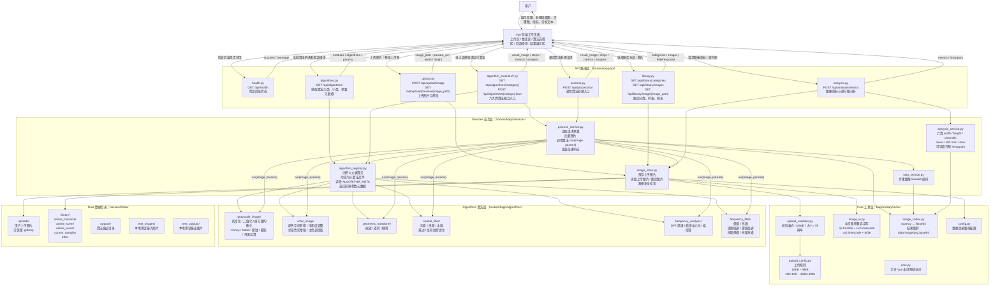

# 调用逻辑图

```mermaid
flowchart TD
    User["用户"]
    Frontend["Vue 前端工作页面<br/>上传区 / 图库区 / 算法选择区 / 参数滑块 / 结果展示区"]

    User --> Frontend

    %% =========================
    %% 后端 API 层
    %% =========================
    subgraph API["API 路由层：backend/app/api/"]
        HealthAPI["health.py<br/>GET /api/health<br/>检查后端状态"]

        UploadAPI["upload.py<br/>POST /api/upload/image<br/>GET /api/upload/preview/{image_path}<br/>上传图片与预览"]

        LibraryAPI["library.py<br/>GET /api/library/categories<br/>GET /api/library/images<br/>GET /api/library/image/{image_path}<br/>图库分类、列表、预览"]

        AlgorithmsAPI["algorithms.py<br/>GET /api/algorithms<br/>获取算法大类、小类、参数元数据"]

        CategoryAPI["algorithm_modules/*.py<br/>GET /api/algorithms/{category}<br/>POST /api/algorithms/{category}/run<br/>六大类算法独立入口"]

        ProcessAPI["process.py<br/>POST /api/process/run<br/>通用算法处理入口"]

        AnalysisAPI["analysis.py<br/>POST /api/analysis/metrics<br/>图像指标与直方图分析"]
    end

    %% =========================
    %% Services 层
    %% =========================
    subgraph Services["Services 业务层：backend/app/services/"]
        ImageStore["image_store.py<br/>保存上传图片<br/>读取上传图片 / 图库图片<br/>路径安全检查"]

        AlgorithmRegistry["algorithm_registry.py<br/>注册 6 大类算法<br/>动态导入算法文件<br/>读取 ALGORITHM_META<br/>返回前端参数元数据"]

        ProcessService["process_service.py<br/>读取请求参数<br/>加载图片<br/>调用算法 run(image, params)<br/>组装结果响应"]

        StepService["step_service.py<br/>步骤图像 Base64 编码"]

        AnalysisService["analysis_service.py<br/>计算 width / height / channels<br/>mean / std / min / max<br/>可选直方图 histogram"]
    end

    %% =========================
    %% Core 层
    %% =========================
    subgraph Core["Core 工具层：backend/app/core/"]
        UploadValidator["upload_validator.py<br/>校验格式 / MIME / 大小 / 分辨率"]

        UploadConfig["upload_config.py<br/>上传规则<br/>10KB ~ 5MB<br/>128×128 ~ 4096×4096"]

        ImageIO["image_io.py<br/>中文路径兼容读写<br/>np.fromfile + cv2.imdecode<br/>cv2.imencode + tofile"]

        ImageCodec["image_codec.py<br/>ndarray ↔ Base64<br/>结果图转 data:image/png;base64"]

        Config["config.py<br/>数据目录路径配置"]

        CORS["cors.py<br/>允许 Vue 本地跨域访问"]
    end

    %% =========================
    %% Algorithms 层
    %% =========================
    subgraph Algorithms["Algorithms 算法层：backend/app/algorithms/"]
        Gray["grayscale_image/<br/>灰度化 / 二值化 / 直方图均衡化<br/>Canny / Sobel / 腐蚀 / 膨胀 / 开闭运算"]

        Color["color_image/<br/>颜色空间转换 / 饱和度调整<br/>动漫色彩增强 / 主色调提取"]

        Geometry["geometric_transform/<br/>缩放 / 旋转 / 翻转"]

        Spatial["spatial_filter/<br/>均值 / 高斯 / 中值<br/>双边 / 拉普拉斯锐化"]

        FreqAnalysis["frequency_analysis/<br/>DFT 频谱 / 频谱中心化 / 幅度谱"]

        FreqFilter["frequency_filter/<br/>低通 / 高通<br/>理想低通 / 理想高通<br/>高斯低通 / 高斯高通"]
    end

    %% =========================
    %% Data 层
    %% =========================
    subgraph Data["Data 数据目录：backend/data/"]
        Uploads["uploads/<br/>用户上传图片<br/>只保留 .gitkeep"]
        Library["library/<br/>anime_character<br/>anime_scene<br/>anime_avatar<br/>course_samples<br/>other"]
        Outputs["outputs/<br/>算法输出目录"]
        TestImages["test_images/<br/>本地测试输入图片"]
        TestOutputs["test_outputs/<br/>本地测试输出图片"]
    end

    %% =========================
    %% 前端到 API
    %% =========================
    Frontend -->|"检查后端是否可用"| HealthAPI
    Frontend -->|"上传图片 / 预览上传图"| UploadAPI
    Frontend -->|"选择图库分类 / 图片"| LibraryAPI
    Frontend -->|"加载算法列表和参数滑块"| AlgorithmsAPI
    Frontend -->|"按大类获取或运行算法"| CategoryAPI
    Frontend -->|"通用算法处理请求"| ProcessAPI
    Frontend -->|"请求图像指标 / 直方图"| AnalysisAPI

    %% =========================
    %% API 到 Service
    %% =========================
    UploadAPI --> ImageStore
    LibraryAPI --> ImageStore
    AlgorithmsAPI --> AlgorithmRegistry
    CategoryAPI --> AlgorithmRegistry
    CategoryAPI --> ProcessService
    ProcessAPI --> ProcessService
    AnalysisAPI --> ImageStore
    AnalysisAPI --> AnalysisService

    %% =========================
    %% Service 到 Core / Data / Algorithms
    %% =========================
    ImageStore --> UploadValidator
    UploadValidator --> UploadConfig
    ImageStore --> ImageIO
    ImageStore --> Config

    ImageStore --> Uploads
    ImageStore --> Library

    AlgorithmRegistry --> Gray
    AlgorithmRegistry --> Color
    AlgorithmRegistry --> Geometry
    AlgorithmRegistry --> Spatial
    AlgorithmRegistry --> FreqAnalysis
    AlgorithmRegistry --> FreqFilter

    ProcessService --> ImageStore
    ProcessService --> AlgorithmRegistry
    ProcessService --> ImageCodec
    ProcessService --> StepService

    ProcessService -->|"run(image, params)"| Gray
    ProcessService -->|"run(image, params)"| Color
    ProcessService -->|"run(image, params)"| Geometry
    ProcessService -->|"run(image, params)"| Spatial
    ProcessService -->|"run(image, params)"| FreqAnalysis
    ProcessService -->|"run(image, params)"| FreqFilter

    StepService --> ImageCodec
    AnalysisService --> ImageCodec

    %% =========================
    %% 返回前端
    %% =========================
    HealthAPI -->|"success / message"| Frontend
    UploadAPI -->|"image_path / preview_url / width / height"| Frontend
    LibraryAPI -->|"categories / images / FileResponse"| Frontend
    AlgorithmsAPI -->|"modules / algorithms / params"| Frontend
    CategoryAPI -->|"result_image / steps / metrics / analysis"| Frontend
    ProcessAPI -->|"result_image / steps / metrics / analysis"| Frontend
    AnalysisAPI -->|"metrics / histogram"| Frontend

    Frontend -->|"展示原图、处理结果图、步骤图、指标、分析文本"| User
```

